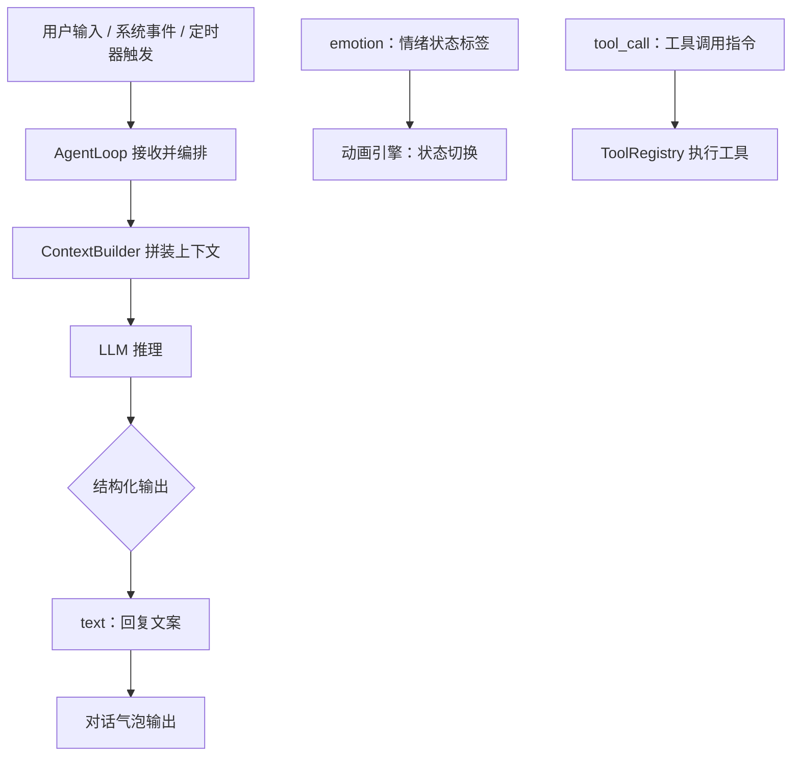
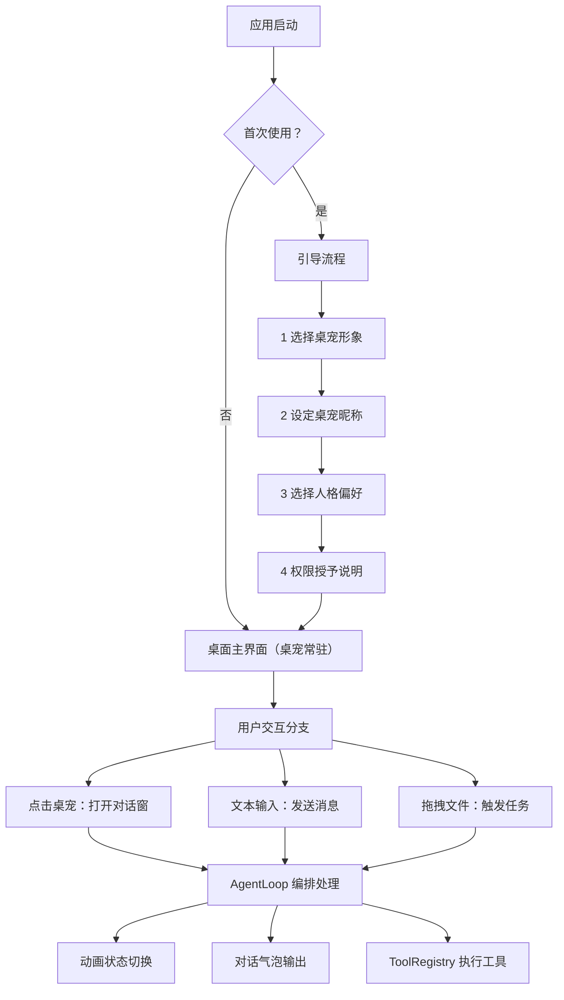

# ClawPet 智能虚拟桌宠 -- 产品需求文档（PRD）

| 文档信息 | 详情 |
|---|---|
| 产品名称 | ClawPet（智能虚拟桌宠） |
| 文档版本 | v1.2 (结构优化版) |
| 创建日期 | 2026-03-28 |
| 目标平台 | Windows / macOS 桌面端 |
| 技术底座 | PicoClaw |

---

# 一、项目背景

随着大模型产品从网页问答场景逐步向桌面常驻、系统深度协作演进，用户对 AI 的核心预期正发生本质变化。用户不再满足于一个“可对话的信息回答者”，而是迫切需要一个能够长期陪伴、精准理解情绪、敏锐感知场景，并在必要时提供轻量高效辅助的桌面智能体。

在电脑高频使用场景中，用户的核心需求清晰聚焦于两大方向，且两者存在强烈的融合诉求：

## 1.1 情感陪伴需求

对于长时间独自使用电脑的用户（尤其是女性用户、极客、自由职业者及数字游民）而言，AI 早已超越单纯的信息工具属性，更承担着情绪支持、陪伴慰藉与正向反馈的角色。这类用户期待 AI 具备持续稳定的人格特质、长期记忆能力、主动关怀意识，以及更具温度、更贴近生活化的交互方式。

## 1.2 桌面辅助需求

在日常电脑使用过程中，用户频繁面临信息查询、轻量提醒、内容整理、简单代办等碎片化事务。传统工具虽能分别解决部分单点问题，但存在切换成本高、表达形式机械、缺乏上下文延续性等痛点，难以形成自然流畅的一体化体验，无法满足用户“随手可用、贴心适配”的核心期待。

ClawPet 的立项初衷，正是为了同时回应上述两类核心需求。产品的核心目标并非打造一款纯聊天工具，也不是开发一个冷冰冰的桌面命令执行器，而是构建一种全新的产品形态——兼具陪伴感、记忆感与轻量工具能力的桌面虚拟伴侣，实现“情感陪伴 + 高效辅助”的无缝融合。

---

# 二、用户痛点

当前市场主流产品，大多只能覆盖用户单一需求，难以完整承接桌面场景下“情绪价值 + 轻量代办”的复合诉求。结合 ClawPet 的产品方向，目标用户的核心痛点可归纳为以下 5 点：

## 2.1 情绪表达被接收，但缺乏共情回应

传统 AI 助手虽能识别文本表面含义，却**缺乏对用户情绪状态的精准感知与共情反馈**。当用户表达低落、委屈、疲惫等负面情绪时，系统往往仅给出理性化回答，无法通过语气、动画、互动形式传递安抚感，导致陪伴价值大打折扣，难以满足用户的情绪慰藉需求。

## 2.2 信息可以获取，但缺乏“有温度的转译”

天气、日历、提醒等工具虽能提供准确的信息结果，但信息呈现方式普遍偏向功能化、模板化，缺乏生活化的关怀表达，**难以转化为引导用户主动行动的有效提醒**。用户真正缺少的并非信息本身，而是基于信息延伸的、有温度的生活化关怀与陪伴感。

## 2.3 用户说过的话无法形成持续记忆

许多重要的计划、个人偏好与情绪线索，往往产生于自然聊天过程，而非正式的任务录入。**现有产品通常无法对这些碎片化表达进行长期沉淀、精准存储与主动唤起**，导致用户“说过的话没有被记住”，无法建立起真实的情感连接与连续的产品体验，难以形成用户依赖。

## 2.4 陪伴产品与工具产品长期割裂

**当前市场产品呈现明显的两极分化**：陪伴型产品擅长建立情感关系、提供情绪支持，但缺乏真实的工具执行能力，无法解决用户的实际事务需求；效率型产品侧重任务执行与流程处理，却缺乏人格感与情绪价值，显得冰冷机械。用户在实际使用中需在两类产品间频繁切换，体验割裂，难以建立稳定的使用习惯。

## 2.5 用户期待主动性，但不接受失控式介入

用户希望系统能够在合适的时机主动提醒、主动关心、主动提供辅助，但这一需求的前提是：**系统具备清晰的交互边界、适度的介入频率与可控的操作权限**。若主动性缺乏合理依据，或介入方式过于强硬、频繁，产品体验会迅速从“贴心”转变为“打扰”，反而降低用户好感度。

> 基于上述痛点，我们对市面上现有的相关产品进行了深度调研，以寻找差异化的切入空间。

---

# 三、市场调研

## 3.1 调研目的

本节旨在通过分析现有市场格局，明确 ClawPet 的产品定位与差异化优势。通过审视竞品在满足用户“情感陪伴”与“高效辅助”两方面需求的不足，为 ClawPet 的立项、用户画像选择及核心功能设计提供决策依据。

### 3.1.1 OpenClaw

OpenClaw 更偏向智能体底层技术框架，主要面向开发者，提供 Agent 框架、工具调用接口与底层能力输出。它的优势在于技术扩展性强、工具接入能力深，但缺乏普通用户可直接使用的可视化产品形态，也不具备情绪陪伴相关设计。

### 3.1.2 NeuroSama（类产品）

NeuroSama（类产品）代表的是偏虚拟陪伴方向的 AI 产品形态，侧重人格化互动、情绪表达与角色陪伴，能够提供较强的情绪价值与存在感，但工具能力较弱，难以进入真实桌面任务场景。

### 3.1.3 传统AI产品

这一类产品强调长期互动、情绪支持和拟人化交流，适合承接用户的孤独感和表达欲，但普遍缺乏真实的工具联动能力，难以帮助用户完成具体事务。

### 3.1.4 自动化 / RPA 产品

这一类产品擅长处理规则明确、重复性高的数字任务，执行能力强，但表达形式冷、配置门槛高，缺少陪伴感和情绪价值，不适合普通消费级用户的日常桌面陪伴场景。

## 3.2 竞品对比

| 对比维度 | ClawPet | OpenClaw | NeuroSama（类产品） |
|---|---|---|---|
| 产品定位 | 桌面虚拟陪伴 + 轻量辅助智能体 | 智能体底层技术框架（面向开发者） | 虚拟陪伴型 AI（侧重情感互动） |
| 核心能力 | 情感陪伴、长期记忆、轻量工具调用、可视化交互 | Agent 框架、工具调用接口、底层能力输出 | 情感互动、人格化对话、基础场景响应 |
| 安装难度 | 一键安装，无需配置，门槛极低 | 需手动配置环境与调试参数，门槛较高 | 安装简单，部分为闭源产品 |
| 情绪价值 | 高，支持情绪识别、情感化回复与动画反馈 | 无，仅提供底层技术，无情感设计 | 高，侧重人格化情感互动，缺乏工具能力 |
| 工具辅助能力 | 中上，支持天气提醒、文件整理等轻量工具，理论上能达到OpenClaw的能力 | 强，可扩展多种工具接口，需二次开发 | 弱，仅支持基础场景响应，无实用工具能力 |
| 目标用户 | 普通桌面用户，兼顾陪伴与辅助 | 开发者、技术团队 | 偏陪伴体验用户 |
| 体验特点 | 情感与工具一体化，强调低门槛与可见反馈 | 技术能力强，但面向普通用户的产品化不足 | 情感氛围强，但缺乏现实任务闭环 |

## 3.3 我们的产品优势

综合竞品对比，ClawPet 的优势不在于单一维度做到最强，而在于将“情感陪伴”与“轻量工具辅助”整合为统一体验：

1. **比底层框架更贴近用户**  
   相比 OpenClaw 这类底层技术框架，ClawPet 通过一键安装、桌宠形象和图形化交互，大幅降低使用门槛，更适合普通用户直接使用。

2. **比纯陪伴产品更有实用价值**  
   相比纯虚拟陪伴产品，ClawPet 不仅能聊天和反馈情绪，还能在天气、提醒、文件整理等场景下提供轻量辅助，形成真实任务闭环。

3. **比传统工具更有温度**  
   相比天气、提醒、自动化类单点工具，ClawPet 通过长期记忆、情绪识别、动画反馈和主动提醒，建立更强的关系感和持续使用动机。

### 结论

ClawPet 基于 OpenClaw / PicoClaw 底层能力做应用层优化，吸收陪伴型产品的情绪价值优势，同时保留智能体工具扩展的潜力，以“一键安装、情感陪伴、轻量辅助、可视化交互”的组合方式形成差异化竞争力。其核心竞争优势在于：**精准填补了当前市场中“陪伴与效率割裂”的空白，更贴合普通用户在桌面环境中的真实使用需求。**

---

# 四、用户画像

ClawPet 第一阶段的核心用户并非泛化的所有电脑用户，而是聚焦于具备明确桌面使用强度、清晰情绪陪伴需求与轻量辅助需求的三类核心人群，精准匹配产品“情感陪伴 + 轻量辅助”的核心价值。

## 4.1 高压打工人（核心画像）

“情绪敏感型职场人”，22-35 岁，互联网、金融、设计等高压行业从业者，日均电脑使用时长 6-10 小时。

**核心特征：**
- 工作强度大，情绪消耗快
- 易产生疲惫、焦虑、内耗等负面情绪
- 缺乏稳定的倾诉对象

**核心需求：**
- 对 AI 的核心期待是 **“情绪共鸣者”**，而非单纯的工具
- 希望在情绪低落时能获得温暖、柔性的安抚
- 无需复杂操作即可获得情绪支持

## 4.2 粗心独居者

“生活佛系型独居人群”，20-30 岁，单身独居，从事自由职业、学生或基层岗位，日均电脑使用时长 4-8 小时。

**核心特征：**
- 生活节奏松散，缺乏规律
- 容易忽视天气变化、饮食规律、休息时间等日常事项
- 独居状态下缺乏他人提醒与关怀

**核心需求：**
- 希望拥有一个 **“有温度的生活助手”**
- 将冰冷的信息（天气、日程）转化为生活化的**主动提醒**
- 填补独居生活中的关怀空白

## 4.3 多线程工作者

“事务繁杂型高效人群”，25-40 岁，管理者、自由职业者、科研人员等，日均电脑使用时长 7-11 小时。

**核心特征：**
- 日常任务繁杂，计划频繁变化
- 许多重要事项仅以随口表达的形式出现，未进行正式待办录入
- 讨厌频繁切换工具

**核心需求：**
- 希望拥有“贴心记忆助手”
- 记住自己的历史表达，并在合适时机主动提醒
- **提供轻量辅助（如生成大纲、整理资料），帮助梳理事务、避免遗漏**

---

# 五、项目要解决的核心问题

ClawPet 当前阶段的核心目标，并非“构建一个功能完备的桌面 Agent”，而是在保证产品体验温度与交互边界的前提下，将情感陪伴、信息转译与轻量代办三大核心能力，整合为一个逻辑自洽、体验流畅的桌面产品闭环。

具体而言，项目需要重点解决以下三个核心问题：

## 5.1 如何让桌宠具备真实的情绪价值

产品需精准识别用户的情绪状态（正面、负面、中性），并通过文本语气、Live2D 动画、语音反馈等多模态方式，形成有反馈感、有共情力的陪伴体验，而非停留在表层的拟人化表达，真正实现“听懂情绪、回应情绪”。

## 5.2 如何让工具能力服务于陪伴体验

产品中的工具能力不应独立于陪伴体系存在，而应成为情感陪伴关系的延伸与强化。工具调用的核心目标，不是展示“系统能做什么”，而是传递“它在关心我，并顺手帮我解决了小麻烦”的体验，让工具能力成为情感连接的纽带。

## 5.3 如何让主动性建立在记忆与情境之上

主动提醒、主动关怀必须基于明确的用户历史表达、时间节点或场景状态判断，而非简单的定时触发。只有当主动性建立在“被记住、被理解”的基础上，用户才能感知到这是“贴心关怀”，而非“无意义打扰”，从而建立起产品信任。

---

# 六、产品定义

ClawPet 并非独立开发的底层引擎，而是基于 OpenClaw 技术框架进行应用层封装与优化的桌面产品。其核心定义不是一个单一工具，也不是传统意义上的聊天机器人，而是一款**常驻桌面的拟人化 AI 虚拟伴侣**：在持续提供情绪陪伴的同时，承接少量真实世界任务的轻量代办与提醒。

从产品形态上，ClawPet 采用“**常驻后台服务 + 轻量化前端交互界面**”的组合方式存在。后台服务持续监听系统事件与环境变化，前端则以桌宠形象为核心载体，为用户提供全局唤醒入口、对话交互界面与状态反馈。系统通过插件化扩展机制，将记忆、工具调用、模型能力与交互入口统一接入同一桌面智能底座中。

从能力边界上，ClawPet 的核心能力应具备六个方面：

1. **上下文感知与事件驱动**  
   持续感知用户的桌面活动、窗口状态、文本选择、文件变化等上下文，并在恰当时机提供建议或执行辅助操作。

2. **多 Agent 协作与任务拆解**  
   面向复杂任务，引入多个子 Agent 分工协作，通过串行或并行方式完成检索、分析、编辑、汇总等工作流。

3. **系统能力调用**  
   通过统一工具层调用本地命令行、浏览器、文件系统、提醒等系统级能力，实现一站式桌面环境控制。

4. **安全透明可控**  
   所有执行过程可见、可确认、可回滚，并通过权限机制、沙箱机制和副作用约束确保用户始终保有最终控制权。

5. **记忆与学习**  
   记录用户的常用任务、偏好和习惯，逐步形成对用户工作方式的抽象理解，从而提升后续辅助的主动性与准确性。

6. **陪伴感与人格化**  
   在强调效率与执行能力的同时，系统保留可配置的人格、鼓励式反馈和视觉 / 声音表达，使其不只是工具，也具备持续陪伴属性。

总结：ClawPet 的产品定义不是做一个底层平台，而是将问答、自动化、系统调用与轻陪伴能力整合为一个持续在线的桌面虚拟伴侣，让用户在日常桌面环境中获得更高层级的协助能力与更低切换成本的使用体验。

---

# 七、用户故事

结合核心用户画像，围绕产品核心能力，设计以下 3 个核心用户故事，精准匹配用户痛点与产品价值，指导功能落地。

## 7.1 高压打工人·情绪安抚场景

作为一名互联网运营，我每天加班到深夜，面对繁杂的工作和 KPI 压力，经常感到疲惫、焦虑，却没有合适的人倾诉。打开 ClawPet 后，我随口和它说“今天好累，KPI 又没完成，感觉自己好没用”，它能快速识别我的低落情绪，不仅用温柔的语气安慰我“辛苦啦宝，你已经很努力啦，偶尔的疲惫很正常，先歇一歇，我一直陪着你”，还会切换委屈陪伴的 Live2D 动画。没有生硬的道理，只有共情的回应，让我感受到被理解、被安抚，缓解当下的负面情绪，短暂卸下工作压力。

## 7.2 粗心独居者·生活提醒场景

作为一名自由职业者，我独居生活，平时专注工作很容易忘记日常事项，经常出门忘带伞、忘记按时吃饭。某天早上我和 ClawPet 闲聊时说“明天要去见客户，希望别下雨”，它默默记住这句话。第二天早上，它主动弹出提醒，带着可爱的动画说“宝～ 今天有小雨哦，记得带伞，见客户顺顺利利呀”；到了中午 12 点，它又会主动提醒我“该吃饭啦，别只顾着工作，按时吃饭才有力气赶进度呀”，把冰冷的天气、时间信息变成有温度的关怀，填补独居生活的关怀空白。

## 7.3 多线程工作者·记忆提醒场景

作为一名项目管理者，我每天要对接多个项目、处理各种琐事，经常随口和同事沟通完计划，转头就忘记。某天我在电脑上和 ClawPet 说“下午 3 点要开项目复盘会，别忘了提醒我”，它会自动提取这句话并存储到长期记忆中。下午 2 点 50 分，它会通过桌面弹窗 + 敲玻璃动画主动提醒我“宝，还有 10 分钟就要开项目复盘会啦，准备好资料哦”；除此之外，我之前和它说过“每周五下午要整理项目周报”，到了周五下午，它也会主动提醒我，不用我特意记录待办，帮助我避免遗漏重要工作，减轻事务管理压力。

---

# 八、功能清单

## 8.1 用户需求及对应功能点

| 用户需求 | 对应功能点 | 优先级 |
|---|---|---|
| 在心情低落时获得安慰和陪伴 | 情绪识别引擎 + 情感化回复生成 + 情绪动画系统 | P0 |
| 日常闲聊，感觉像和真人对话 | 人格化对话系统（一致性人设 + 长期记忆） | P0 |
| 查天气等信息时得到有温度的反馈 | 外部 API 调用 + LLM 情感化数据转译 | P0 |
| 随口提到的计划能被记住并主动提醒 | 长期记忆库 + 定时记忆扫描 + 主动唤醒机制 | P0 |
| 拖拽文件让桌宠帮忙整理 | 文件拖拽监听 + 本地文件整理工具 + 任务动画 | P1 |
| 桌宠能帮忙打开应用、搜索文件 | 系统指令执行模块（应用启动、文件检索） | P1 |
| 桌宠外观可自定义 | 形象皮肤系统 + 装扮商城 | P1 |
| 通过语音和桌宠交流 | 语音输入（ASR）+ 语音输出（TTS） | P2 |
| 桌宠能帮忙管理浏览器标签 / 书签 | 浏览器扩展 + 标签管理工具 | P2 |

## 8.2 功能清单总览（与第一次 Milestone 真实情况可能有出入）

| 功能模块 | 功能项 | MVP | 完全体 |
|---|---|---|---|
| **情感对话核心** | 文本对话 | 支持 | 支持 |
|  | 情绪识别与情感化回复 | 支持 | 支持 |
|  | 人格一致性（人设系统） | 支持 | 支持 |
|  | 语音输入 / 输出 | -- | 支持 |
|  | 屏幕监控/图片输入 | -- | 支持 |
| **记忆系统** | 短期记忆（对话上下文窗口） | 支持 | 支持 |
|  | 长期记忆存储与检索 | 支持 | 支持 |
|  | 定时记忆扫描与主动提醒 | 支持 | 支持 |
| **工具调用** | 天气查询 + 情感化转译 | 支持 | 支持 |
|  | 系统音乐播放器调用 | 支持 | 支持 |
|  | 本地文件整理（拖拽触发） | -- | 支持 |
|  | 应用启动 / 文件搜索 | -- | 支持 |
|  | 浏览器标签管理 | -- | 支持 |
| **视觉表现** | Live2D 桌宠渲染 | 支持 | 支持 |
|  | 情绪动画状态机（不少于 8 种情绪） | 支持 | 支持 |
|  | 任务执行动画（搬砖、擦汗等） | -- | 支持 |
|  | 皮肤 / 装扮系统 | -- | 支持 |
| **系统交互** | 桌面常驻悬浮窗 | 支持 | 支持 |
|  | 系统托盘管理 | 支持 | 支持 |
|  | 文件拖拽接收 | -- | 支持 |
|  | 全局快捷键唤醒 | 支持 | 支持 |

## 8.3 核心功能逻辑

ClawPet 的核心运行逻辑可归纳为一条统一的 **“感知 -- 思考 -- 执行”** 处理链路，所有功能均围绕此链路展开，确保体验连贯、逻辑闭环：

### 关键设计决策

1. LLM 统一输出结构化 JSON，包含 `text`（回复文案）、`emotion`（情绪标签，驱动动画）、`tool_call`（工具调用指令），应用层解析后并行执行动画切换与工具调用，提升响应效率。  
2. 情绪状态不完全依赖 LLM 实时判断，应用层维护一个**情绪状态机**，LLM 输出的 emotion 标签作为状态迁移的输入信号，确保情绪表现连贯稳定。  
3. 底层基于 PicoClaw 的四大核心组件：**AgentLoop**（消息编排中心）、**AgentInstance**（状态容器）、**ContextBuilder**（提示词工程）、**ToolRegistry**（工具管理），保障系统可扩展性。  
4. 长期记忆采用 PicoClaw 内置的 **MEMORY.md 文件持久化**机制存储，定时扫描任务独立于对话流程运行，避免占用对话响应资源。  
5. 情感人设通过 PicoClaw 的 **SOUL.md**（灵魂 / 性格）、**IDENTITY.md**（身份设定）、**USER.md**（用户画像）三个配置文件定义，修改后实时生效，无需重启应用，降低调试成本。  

---

# 九、产品架构

## 9.1 页面流程图

## 9.2 功能架构图（信息架构图）

```mermaid
graph TD
  Root["ClawPet 功能架构"]

  Root --> FE["前端展示层"]
  Root --> Core["核心逻辑层"]
  Root --> Tool["工具调用层"]
  Root --> Infra["基础设施层"]

  FE --> FE1["桌宠渲染引擎 Live2D"]
  FE1 --> FE1a["角色模型加载"]
  FE1 --> FE1b["情绪动画状态机"]
  FE1 --> FE1c["任务动画播放器"]

  FE --> FE2["对话气泡 UI"]
  FE2 --> FE2a["文本消息渲染"]
  FE2 --> FE2b["快捷操作按钮"]
  FE2 --> FE2c["打字机效果输出"]

  FE --> FE3["悬浮窗管理"]
  FE3 --> FE3a["窗口置顶 / 拖拽"]
  FE3 --> FE3b["最小化到托盘"]
  FE3 --> FE3c["全局快捷键"]

  FE --> FE4["设置面板"]
  FE4 --> FE4a["桌宠形象 / 皮肤"]
  FE4 --> FE4b["人格偏好设置"]
  FE4 --> FE4c["权限管理"]
  FE4 --> FE4d["记忆管理"]

  Core --> C1["AgentLoop 消息编排中心"]
  C1 --> C1a["用户请求生命周期管理"]
  C1 --> C1b["事件驱动调度"]

  Core --> C2["AgentInstance 状态容器"]
  C2 --> C2a["工作区管理"]
  C2 --> C2b["工具权限管理"]
  C2 --> C2c["会话历史管理"]

  Core --> C3["ContextBuilder 提示词工程"]
  C3 --> C3a["SOUL.md 性格注入"]
  C3 --> C3b["IDENTITY.md 身份注入"]
  C3 --> C3c["USER.md 用户画像注入"]
  C3 --> C3d["技能注入"]

  Core --> C4["ToolRegistry 工具管理"]
  C4 --> C4a["工具注册与发现"]
  C4 --> C4b["LLM 调用执行"]
  C4 --> C4c["结构化输出解析"]

  Core --> C5["记忆系统"]
  C5 --> C5a["短期记忆（对话上下文窗口）"]
  C5 --> C5b["长期记忆（MEMORY.md 文件持久化）"]
  C5 --> C5c["记忆写入（对话后自动提取）"]
  C5 --> C5d["定时扫描器（主动提醒触发）"]

  Core --> C6["情绪状态机"]
  C6 --> C6a["状态定义与转移规则"]
  C6 --> C6b["动画映射表"]

  Core --> C7["主动行为引擎"]
  C7 --> C7a["定时触发器"]
  C7 --> C7b["事件触发器"]
  C7 --> C7c["行为排队与冷却机制"]

  Tool --> T1["天气查询服务（外部 API）"]
  Tool --> T2["音乐播放控制（系统 API）"]
  Tool --> T3["文件整理工具（本地文件系统）"]
  Tool --> T4["应用启动器（系统命令）"]
  Tool --> T5["文件搜索（本地索引）"]
  Tool --> T6["浏览器扩展桥接 V2"]

  Infra --> I1["PicoClaw 智能体引擎"]
  Infra --> I2["工作区 ~/.picoclaw/workspace/"]
  Infra --> I3["配置管理 config.json"]
  Infra --> I4["MCP 协议外部服务桥接"]
  Infra --> I5["安全沙箱（工作区隔离）"]
  Infra --> I6["日志与异常上报"]
  Infra --> I7["自动更新服务"]
```

---

# 十、项目目标与里程碑

项目总周期 1.5 个月，前 2 周为产品设计与原型阶段，后 4 周为开发与上线阶段。每 2 周设置一次里程碑验收，明确各阶段交付物与验收标准，确保项目有序推进。

| 阶段 | 时间区间 | 交付物 | 验收条件 |
|---|---|---|---|
| **M0：产品设计（已完成）** | **03-12 — 03-29** | **PRD 文档 + 原型图 + 技术选型方案** | PRD 评审通过；原型图具备初步 MVP 页面；PicoClaw 技术可行性验证完成 |
| **M1：核心对话 + 记忆系统** | **03-29 — 04-08** | **有记忆、能对话的桌宠** | ① Live2D 桌宠渲染正常，支持不少于 8 种情绪动画切换；② 文本对话端到端跑通（用户输入 → LLM 回复 → 气泡输出）；③ 人设系统生效（切换 SOUL.md 后对话风格明显变化）；④ 情绪状态机按转移规则正常工作；⑤ 对话后自动提取记忆并写入 MEMORY.md；⑥ 新对话能检索并引用历史记忆；⑦ 定时扫描触发主动提醒（含敲玻璃动画）；⑧ 记忆管理页面可查看和删除记忆条目 |
| **M2：工具调用 + 打磨上线** | **04-09 — 04-23** | **MVP 上线版本** | ① 天气查询工具调通，返回数据经 LLM 情感化转译输出；② 音乐播放工具可调用系统播放器；③ 提醒设置工具可写入记忆并按时触发；④ 工具调用过程有对应动画联动；⑤ 新手引导流程完整可走通（4 步 + 桌宠登场）；⑥ 设置面板各 Tab 功能正常；⑦ 性能达标（启动 ≤ 3s、空闲内存 ≤ 150MB、动画 ≥ 30FPS）；⑧ 敏感词过滤与权限管理就绪；⑨ 完成冒烟测试，无 P0 / P1 级缺陷 |

---

# 十一、产品愿景

ClawPet 的目标并不止于完成一款桌宠产品。桌宠只是产品的起点，是用户感知陪伴价值与工具价值的第一层入口。

从长期来看，ClawPet 希望构建的是一个围绕“虚拟桌宠”展开的开放平台：用户不仅可以拥有一个能够陪伴自己、理解自己、帮助自己的桌宠，还能够持续定制其形象、人格与能力，使其成为真正具有个人属性的数字伴侣。

在更长远的规划中，ClawPet 还希望进一步开放创作与分发能力，让桌宠不只是被使用的产品角色，也能成为被创造、被订阅、被经营的数字内容载体。用户与创作者可以围绕桌宠形成表达、交易与运营关系，桌宠也可以进一步延展为直播形象、个人品牌或商业 IP 的一部分。

因此，ClawPet 的产品愿景可以概括为：

**以桌宠为入口，先做有温度的桌面虚拟伴侣，再逐步发展为一个支持定制、创作、分发与商业化的桌宠平台。**
